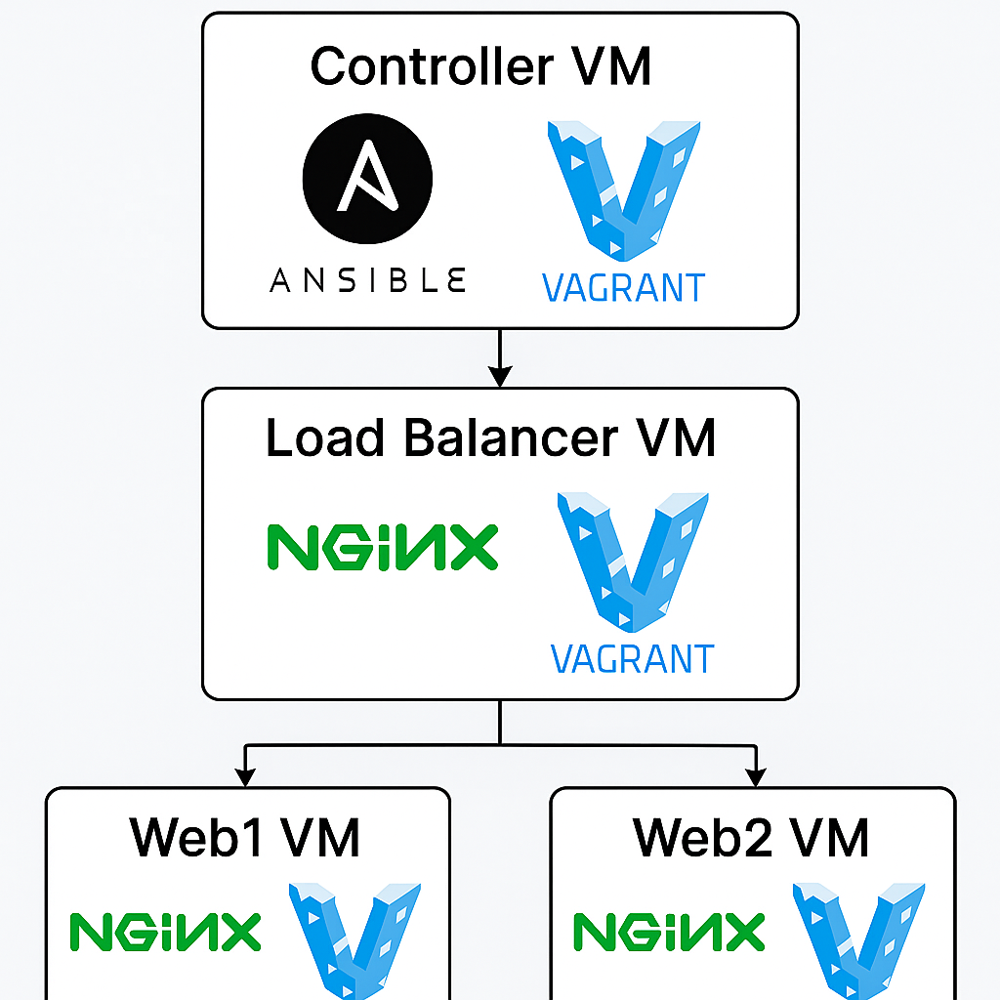
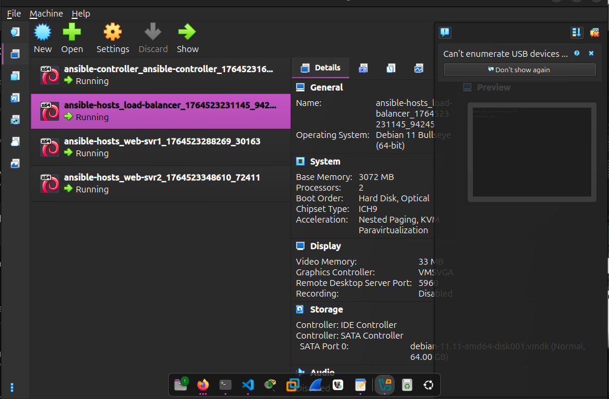

  

# Automated Web Infrastructure (Ansible + Vagrant + Nginx)

This project deploys a fully automated web infrastructure using **Ansible**, **Vagrant**, and **Nginx**.  
It includes **4 virtual machines** created and  **with Vagrant (VirtualBox)** and then fully configured via **Ansible roles**:

- **Ansible Controller**
- **Nginx Load Balancer**
- **Web Server 1**
- **Web Server 2**

  

#### 🎯The goal of this project was to learn how Vagrant manages VM provisioning and to improve my Ansible automation skills while building a reproducible mini web infrastructure.

---

## 🚀 Vagrant Configuration

Two Vagrantfiles were created:

- one for the **Ansible Controller**
- one for the **Load Balancer + Web Servers**
